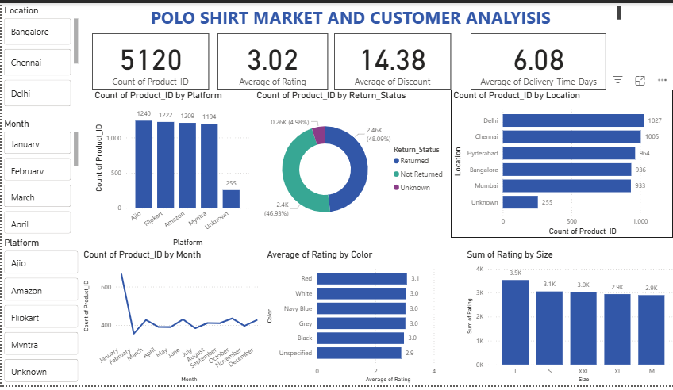

# 👕 PoloMax Product Performance Analysis


## 📖 Executive Summary
During my internship as a Product Research Analyst, I analyzed **5,120 customer reviews and transactions** for PoloMax (a fashion e-commerce brand) to diagnose a critical business issue: a **48% product return rate**.

Using SQL for data extraction and exploratory data analysis (EDA), I identified that the high return rate was a systemic product quality issue rather than a logistics failure. My analysis provided data-backed recommendations to pause underperforming SKUs and double down on high-revenue variants.

---

## 📊 Dashboard Preview

*Visual overview of market performance, return rates by location, and rating distribution.*

---

## 🎯 Business Problem
The brand faced declining profitability due to:
* A critically high **Return Rate (48.09%)**.
* Mediocre Customer Satisfaction (**3.02 Avg Rating**).
* Unknown performance drivers across different SKUs (Colors/Sizes).

**Objective:** Analyze sales data to pinpoint the root cause of returns and identify high-value opportunities.

---

## 🛠️ Tech Stack & Skills
* **SQL (MySQL):** Used for data cleaning, aggregation, `CASE` statements, and complex filtering.
* **Data Analysis:** Trend analysis, correlation (Price vs. Rating), and root cause analysis.
* **Data Visualization:** Created dashboard mockups to visualize geographic spread and SKU performance.
* **Strategic Planning:** Translated raw data into actionable business steps (e.g., "Pause Black variant sales").

---

## 🔍 Key Insights & SQL Logic

### 1. The "Black Shirt" Quality Issue
I discovered a strong correlation between color variants and customer ratings. While **Red** shirts were the top revenue drivers (~964k), **Black** shirts consistently received the lowest ratings (2.98), indicating a specific fabric or dye issue.

**SQL Snippet Used:**
```sql
-- Average Price vs. Average Rating by Material (Proxy: Color)
SELECT Color as Material_Proxy, 
       ROUND(AVG(Price), 2) as Avg_Price, 
       ROUND(AVG(Rating), 2) as Avg_Rating 
FROM tshirts 
GROUP BY Color;
```

### 2. Systemic vs. Localized Returns
To determine if returns were due to logistics (e.g., a bad courier in Delhi) or the product itself, I analyzed return rates by location. The rate was consistent (~48%) across all cities, proving the issue was systemic (product fit/sizing).

```

-- Return Rate by Location
SELECT Location, 
       ROUND((SUM(CASE WHEN Return_Status = 'Returned' THEN 1 ELSE 0 END) * 100.0 / COUNT(*)), 2) as Return_Rate
FROM tshirts 
GROUP BY Location;
```

### 3. Emerging Growth
Identified SKU POLO-66138 as the top gaining product, jumping from zero visibility in 2024 to significant traction in 2025.

###🚀 Recommendations
Based on the data, I proposed the following strategy to the stakeholders:

Immediate Action: Pause sales of the Black variant to stop brand damage.

Audit: Conduct a full audit of the sizing chart (primary suspect for the 48% return rate).

Inventory Shift: Expand the "Red" product line, which drives high volume and high satisfaction.

Target Metrics: Aim to reduce return rate to 25%, which is projected to increase profit margins by 23%.

### Project Structure
- polo_tshirt_cleaned_dataset.csv: The raw dataset containing 5,120 records.

- polo_shirt_sql_queries.sql: Complete SQL script containing all analytical queries.

- PoloMax_Product_Analysis.pdf: Final presentation deck presented to stakeholders.

- SQL_POLO_SHIRT_ANALYSIS_REPORT.docx: Detailed written report of findings.


